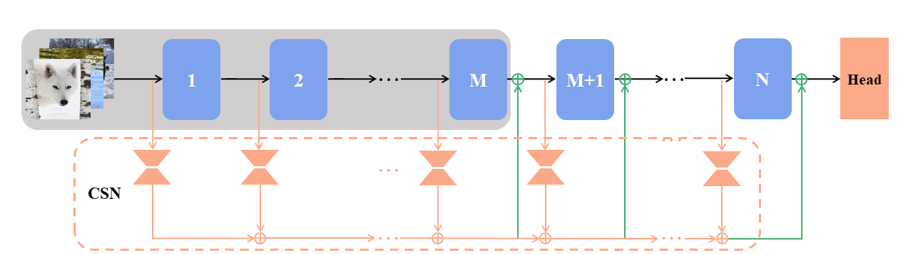
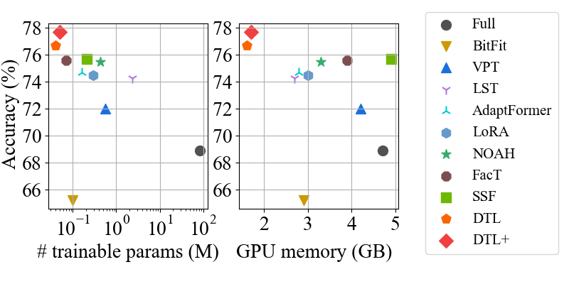

# DTL for Memory-Efficient Tuning

This repo is the official implementation of our AAAI2024 paper "DTL: Disentangled Transfer Learning for Visual Recognition" ([arXiv](https://arxiv.org/abs/2312.07856)). 

<div align="center">
<div>
    <a href='https://www.lamda.nju.edu.cn/fumh/' target='_blank'>Minghao Fu</a>&emsp;
    <a href='https://www.lamda.nju.edu.cn/zhuk/' target='_blank'>Ke Zhu</a>&emsp;
    <a href='https://cs.nju.edu.cn/wujx/' target='_blank'>Jianxin Wu</a>
</div>
<div>
    LAMDA, Nanjing University
</div>




<h3>TL;DR</h3>
    
Different from current efficient tuning methods [Adapter](https://arxiv.org/abs/1902.00751), [LoRA](https://arxiv.org/abs/2106.09685) and [VPT](https://arxiv.org/abs/2203.12119) that closely entangle the small trainable modules with the huge frozen backbone. We **disentangle** the weights update from the backbone network using a lightweight Compact Side Network (CSN). DTL not only **greatly reduces GPU memory footage**, but also achieves high accuracy in knowledge transfer.



---


</div>


## Environment


- python 3.8
- pytorch >= 1.7
- torchvision >= 0.8
- timm 0.5.4

## Data Preparation

### 1. Visual Task Adaptation Benchmark (VTAB)

Please refer to [SSF](https://github.com/dongzelian/SSF) or [VPT](https://github.com/KMnP/vpt/blob/main/VTAB_SETUP.md) for preparing the 19 datasets included in VTAB-1K. 
**For convenience, you can download the extracted file ([VTAB.zip](https://box.nju.edu.cn/f/57d5913e680243fca32b/?dl=1)) to easily access the datasets.**

### 2. Few-Shot Classification
We follow [NOAH](https://github.com/ZhangYuanhan-AI/NOAH) to conduct the few-shot evaluation. There are two parts you shold pay attention to:
- Images
  
  For improved organization and indexing, images from five datasets (`fgvc-aircraft, food101, oxford-flowers102, oxford-pets, standford-cars`) should be consolidated into a folder named **FGFS**.
- Train/Val/Test splits
    
   The content, copied from the `data/few-shot` directory in [NOAH](https://github.com/ZhangYuanhan-AI/NOAH/tree/main/data/few-shot), should be placed in the FGFS folder and renamed as `few-shot_split` for path correction.

The file structure should look like:
  ```bash
  FGFS
  ├── few-shot_split
  │   ├── fgvc-aircraft
  │   │   └── annotations
  │   │       ├── train_meta.list.num_shot_1.seed_0
  │   │       └── ...
  │   │    ...
  │   └── food101
  │       └── annotations
  │           ├── train_meta.list.num_shot_1.seed_0
  │           └── ...
  ├── fgvc-aircraft
  │   ├── img1.jpeg
  │   ├── img2.jpeg
  │   └── ...
  │   ...
  └── food101
      ├── img1.jpeg
      ├── img2.jpeg
      └── ...
  ```
**For convenience, the extracted datasets are uploaded ([FGFS.zip](https://box.nju.edu.cn/f/0573ec3fd913418dbf0e/?dl=1)).**

### 3. Domain Generalization

- Images

  Please refer to [DATASETS.md](https://github.com/KaiyangZhou/CoOp/blob/main/DATASETS.md) for [ImageNet](https://github.com/KaiyangZhou/CoOp/blob/main/DATASETS.md#imagenet), [ImageNet-A](https://github.com/KaiyangZhou/CoOp/blob/main/DATASETS.md#imagenet-a), [ImageNet-R](https://github.com/KaiyangZhou/CoOp/blob/main/DATASETS.md#imagenet-r), [ImageNet-Sketch](https://github.com/KaiyangZhou/CoOp/blob/main/DATASETS.md#imagenet-sketch) and [ImageNetV2](https://github.com/KaiyangZhou/CoOp/blob/main/DATASETS.md#imagenetv2) to download the images on these datasets. Probably you should create a new directory named `DG` to contain them as the root.

- Test splits
     
  Copied from the [`data/domain-generalization`](https://github.com/ZhangYuanhan-AI/NOAH/tree/main/data/domain-generalization). The directory 'annotations' needs to be placed within the subdirectory of each dataset.

**For convenience, the extracted datasets are uploaded ([DG.zip](https://box.nju.edu.cn/f/9c8c72affc074d17a252/?dl=1)).**

**Note**: The training set for ImageNet (`train` directiory in `DG/imagenet/images`) has not been uploaded due to the large file size, so you will need to prepare it yourself (probably by a symbolic link).


## Usage

### Pre-trained Models

- The pre-trained weights of ViT-B/16 is stored at this [link](https://storage.googleapis.com/vit_models/imagenet21k/ViT-B_16.npz).
- For Swin-B, the pre-trained weights will be automatically download to cache directory when you run training scripts.

### Fine-tuning ViT-B/16 on VTAB

```
bash train_scripts/vit/vtab/$DATASET_NAME/train_dtl(+).sh
```
- Replace `DATASET_NAME` with the name you want for your dataset.
- Update the `data_dir` and `load_path` variables in the script to your specified values.

### Fine-tuning ViT-B/16 on Few-shot Learning

```
bash train_scripts/vit/few_shot/$DATASET_NAME/train_dtl(+)_shot_$SHOT.sh
```

### Fine-tuning ViT-B/16 on Domain Generalization
```
bash train_scripts/vit/domain_generalization/$DATASET_NAME/train_dtl(+).sh
```

### Fine-tuning Swin-B on VTAB
```
bash train_scripts/swin/vtab/$DATASET_NAME/train_dtl(+).sh
```

### Citation
If this project is helpful for you, you can cite our paper:
```
@inproceedings{fu2024dtl,
      title={DTL: Disentangled Transfer Learning for Visual Recognition},
      author={Fu, Minghao and Zhu, Ke and Wu, Jianxin},
      booktitle={Proceedings of AAAI Conference on Artificial Intelligence (AAAI)},
      year={2024},
}
```


### Acknowledgement
The code is built upon [SSF](https://github.com/dongzelian/SSF), [NOAH](https://github.com/ZhangYuanhan-AI/NOAH), [VPT](https://github.com/KMnP/vpt) and [timm](https://github.com/rwightman/pytorch-image-models). 
